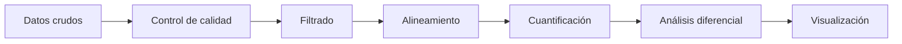
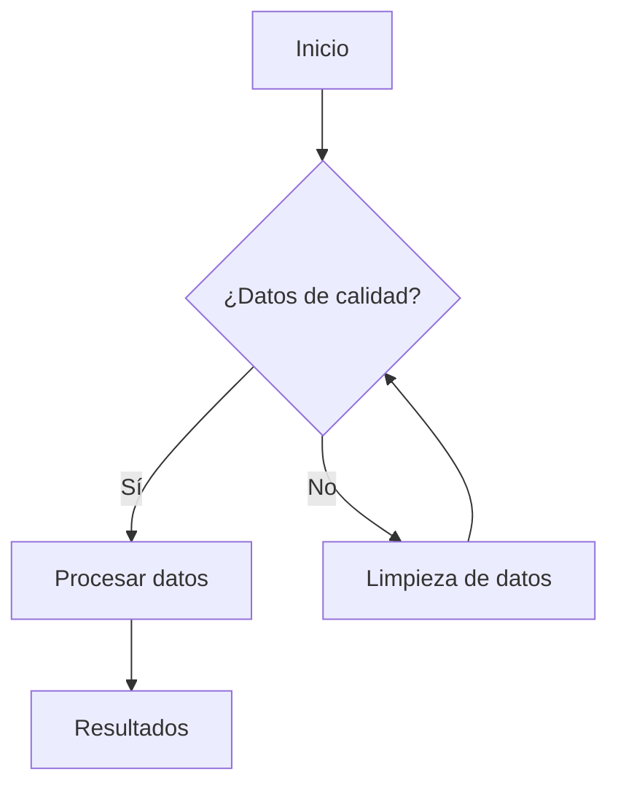

# Proyecto: Análisis de calidad y reconstrucción filogenética de secuencias de Mycobacterium spp. mediante herramientas bioinformáticas 

## Integrantes
- Allison Baño 
- Kevin Campaña 
- Raul Ramos
- Gabriela Zambrano
- Paulo Franco 

## Objetivo
Integrar herramientas bioinformáticas de control de calidad, preprocesamiento y análisis filogenético para evaluar secuencias genómicas y relaciones evolutivas entre especies del género Mycobacterium mediante datos de secuenciación masiva y secuencias 16S rRNA.

### Objetivos específicos

1.	Evaluar la calidad de lecturas FASTQ de Mycobacterium tuberculosis mediante herramientas bioinformáticas especializadas para identificar errores, adaptadores y regiones de baja calidad en los datos de secuenciación.
2.	Realizar el preprocesamiento y filtrado de secuencias utilizando herramientas de trimming y depuración bioinformática para optimizar la confiabilidad de los análisis posteriores.
3.	Construir e interpretar un árbol filogenético basado en secuencias 16S rRNA de diferentes especies del género Mycobacterium para analizar sus relaciones evolutivas y patrones de agrupamiento molecular.

## Dataset

#Secuencias FASTQ

Se utilizaron lecturas paired-end Illumina correspondientes a Mycobacterium tuberculosis, SRA: ERR2510812 obtenidas desde la base de datos pública NCBI-SRA.

#Secuencias 16S rRNA

Se seleccionaron secuencias de referencia del gen 16S rRNA pertenecientes a diferentes especies del género Mycobacterium:

Mycobacterium tuberculosis
Mycobacterium kansasii
Mycobacterium gordonae
Mycobacterium avium subsp. paratuberculosis
Mycolicibacterium smegmatis

Las secuencias fueron descargadas desde NCBI en formato FASTA.

# Flujo de trabajo 

## FLUJO DE TRABAJO DE GALAXY


## Explicación 
El flujorama de procesos de Galaxy, se divide en dos secciones, de las cuales van desde la evaluación de la calidad de lo datos crudos hasta la recontrucción del árbol de filogenetica de la secuencia 16S 

### Parte 1: Control de calidad de lecturas FASTQ

Esta fase inicial es fundamental para asegurar que los datos de secuenciación sean lo suficientemente fiables antes de realizar cualquier análisis biológico.

- NCBI SRA e Importación: El proceso comienza con la obtención de datos desde el NCBI Sequence Read Archive (SRA). Estos archivos se importan directamente al entorno de Galaxy para mantener la trazabilidad de los datos.

- FastQC (Control Inicial): Se ejecuta esta herramienta para generar un diagnóstico visual de la calidad de las bases, contenido de GC y presencia de adaptadores.

- Fastp (Trimming y Filtrado): Actúa como una etapa de limpieza industrial. Fastp elimina automáticamente los adaptadores de secuenciación y recorta las bases de baja calidad en los extremos. Además, filtra lecturas que no cumplen con una longitud mínima.

- FastQC Post-filtrado y Comparación: Se repite el análisis de calidad para validar que la limpieza fue efectiva. Finalmente, se realiza una comparación de métricas antes y después para confirmar que los datos resultantes son óptimos para la siguiente fase.

### Parte 2: Curación y análisis de secuencias 16S

Una vez que los datos son de alta calidad, el flujo se desplaza hacia la caracterización taxonómica y evolutiva.

- 16S rRNA completas y Revisión (Fasta statistics): Se trabaja con secuencias del gen 16S rRNA. El primer paso es una revisión estadística (longitud, cantidad de secuencias, composición de bases) mediante Fasta statistics para verificar la homogeneidad de la muestra.

- MAFFT (Alineamiento Múltiple): Es el proceso central de la segunda parte. MAFFT alinea las secuencias de nucleótidos para identificar regiones conservadas y variables, lo cual es el insumo necesario para entender las relaciones de parentesco.

- FastTree (Inferencia Filogenética): Utilizando el alineamiento previo, FastTree genera un árbol filogenético de manera eficiente, incluso con grandes volúmenes de secuencias, basándose en métodos de máxima verosimilitud aproximada.

- Árbol Filogenético (Resultado Final): El proceso culmina con la visualización del árbol, que permite interpretar la biodiversidad de la muestra y la cercanía evolutiva entre los distintos microorganismos identificados.

## FLUJO DE TRABAJO DEL CODIGO DE LA MAQUINA VIRTUAL


## Explicación 

El flujograma detalla la metodología de trabajo para el analis de control de calidad de datos de la secuencia de ADN de alto rendimiento, el proceso se divide en 5 etepas principalmente: 

1. Descarga de Datos Raw (Crudos): Se inicia con la selección de las bases de datos NCBI/ENA y la descarga de los archivos FASTQ crudos (ERR2510812_1.fastq.gz y ERR2510812_2.fastq.gz).

2. Evaluar Calidad Inicial: Se realiza un análisis detallado de la calidad de los reads crudos, incluyendo el perfil de calidad por base, la duplicación de secuencias y el contenido de GC. Se generan reportes HTML para visualizar estos datos.

3. Trimming de Reads: Se aplican parámetros de limpieza, como SLIDINGWINDOW y MINLEN, para eliminar adaptadores y filtrar reads de baja calidad. Se generan reads limpios (paired) y reads no pareados (unpaired), que se separan para el análisis posterior.

4. Evaluar Calidad Post-Trimming: Se repite el análisis de calidad con los reads limpios para verificar la mejora en el perfil de calidad y la eliminación de adaptadores. Se generan nuevos reportes HTML.

5. Visualizar Resultados: Se abren los reportes de calidad generados en el navegador para su análisis comparativo, facilitando la inspección de los datos y la toma de decisiones informadas sobre la calidad de los reads.

## Resultados
### Control de calidad
#### Secuencias crudas

Los archivos forward y reverse presentan una calidad general excelente, acumulando un total de 569,449 secuencias de longitud o 76 bases, en estos resultados destaca principalmente un contenido total de 64% de GC idéntico en ambas cadenas confirmando que la muestra pertenece a un microorganismo de alto GC. Finalmente al final de la lectura reverse se observa que la calidad de la base final decae drásticamente a un puntaje Phred de 2 indicando que los datos son altamente confiables para el análisis biológico.

#### Secuencias procesadas 

Mediante el proceso de trimming ambos archivos conservan una sincronía con exactamente 488,503 secuencias emparejadas y sin variar la cantidad de 64% de contenido GC. Además se corrigio la calidad de la base final y ahora todo el espectro de secuencias se ubica en la zona verde de alta calidad de Phred >30 quedando listos y optimizados para un alineamiento genómico o ensamble molecular de alta precisión.

## Cómo reproducir
### Scripts
Si es necesario genere un documento .md adicional o una carpeta para los scripts, si le hace falta (opcional)
bash scripts/pipeline.sh  

### NOTA: Hasta aquí llega el formato de README para su proyecto, en adelante le coloco información adicional


# DETALLES Y RECOMENDACIONES PARA FORMATO .md Y MÁS
El informe será un documentos en Github en formato Markdown (método de escritura, basado en un formato de texto plano).
Aquí vemos la diferencia entre un procesador de texto (tipo Word) vs Markdown, abiertos en un editor de texto plano. 


Les dejo algunos formatos para el uso :+1: :

## 1. Titulos
```
# Título primer nivel
## Título segundo nivel
###  Título tercer nivel
```
Se visualiza así:
# Título primer nivel
## Título segundo nivel
###  Título tercer nivel

## 2. Texto en negrita
```
**Hola**
```
**Hola**

## 3. Texto en cursiva

```
*Hola*
```
*Hola*

## 4. Superíndice y subíndice
```
Este es un <sub>subíndice</sub> 
Este otro es un <sup>superíndice</sup> 
```
Este es un <sub>subíndice</sub> 

Este otro es un <sup>superíndice</sup>

## 5. Adicionar línea de comando

````
```
Mira, puedes ver las comillas y formato
```
````
Se ve así:

```
Mira, puedes ver las comillas y formato
```
## 6. Links
```
Este sitio fue construido usando [GitHub](https://pages.github.com/)
```
Este sitio fue construido usando [GitHub](https://pages.github.com/)

## 7. Listas
```
Usa * - o + por ejemplo:
* Empezamos en 3
+ Empezamos en 2
- Empezamos en 1
* 0
```

Visualizamos así:
* Empezamos en 3
+ Empezamos en 2
- Empezamos en 1
* 0

## 8. Creaciones de diagramas

Creando un diagrama parcial  de pipeline:
````

````


````

````




```mermaid
flowchart LR
    A[Datos crudos] --> B[Control de calidad]
    B --> C[Filtrado]
    C --> D[Alineamiento]
    D --> E[Cuantificación]
    E --> F[Análisis diferencial]
    F --> G[Visualización]

    %% Colores de nodos con texto y borde negro
    style A fill:#f9f,stroke:#000,stroke-width:2px,color:#000
    style B fill:#bbf,stroke:#000,stroke-width:2px,color:#000
    style C fill:#bfb,stroke:#000,stroke-width:2px,color:#000
    style D fill:#ffb,stroke:#000,stroke-width:2px,color:#000
    style E fill:#fbf,stroke:#000,stroke-width:2px,color:#000
    style F fill:#fbb,stroke:#000,stroke-width:2px,color:#000
    style G fill:#bff,stroke:#000,stroke-width:2px,color:#000
```

## LINKS DE INTERES PARA SU INFORME
1. Proceso para invitar a [colaboradores](https://docs.github.com/es/repositories/managing-your-repositorys-settings-and-features/repository-access-and-collaboration/inviting-collaborators-to-a-personal-repository) a su proyecto
2. Información sobre los [repositorios](https://docs.github.com/es/repositories)
3. Aprender sobre Github en la [Guía de inicio rápido](https://docs.github.com/es/get-started/start-your-journey)
4. Síntaxis [Markdown](https://markdown.es/sintaxis-markdown/)
5. Ejercicio para iniciar con [Markdown](https://github.com/skills/communicate-using-markdown)
6. Adición de [emoticones](https://gist.github.com/rxaviers/7360908) a su página
7. Lista de [DDBB](https://github.com/BioUPS/Bioinf/blob/main/Proyecto_ejemplo/DB_list.md)
