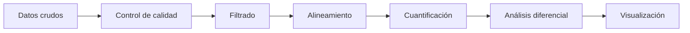
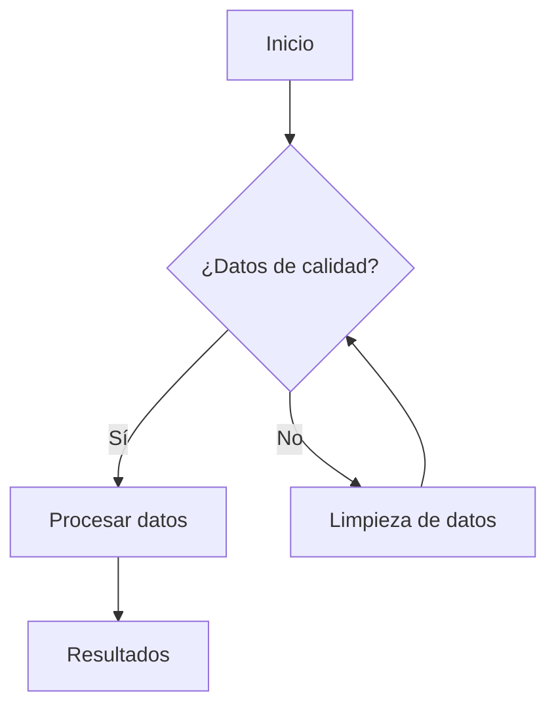

# Proyecto: Análisis bioinformático de calidad y relaciones filogenéticas en especies del género Mycobacterium mediante secuencias de nueva generación y marcadores 16S rRNA 

## Integrantes
- Allison Baño 
- Kevin Campaña 
- Raul Ramos
- Gabriela Zambrano
- Paulo Franco 

## Objetivo
Integrar herramientas bioinformáticas de control de calidad, preprocesamiento y análisis filogenético para evaluar secuencias genómicas y relaciones evolutivas entre especies del género Mycobacterium mediante datos de secuenciación masiva y secuencias 16S rRNA.

### Objetivos específicos

1.	Evaluar la calidad de lecturas FASTQ de Mycobacterium tuberculosis mediante herramientas bioinformáticas especializadas para identificar errores, adaptadores y regiones de baja calidad en los datos de secuenciación.
2.	Realizar el preprocesamiento y filtrado de secuencias utilizando herramientas de trimming y depuración bioinformática para optimizar la confiabilidad de los análisis posteriores.
3.	Construir e interpretar un árbol filogenético basado en secuencias 16S rRNA de diferentes especies del género Mycobacterium para analizar sus relaciones evolutivas y patrones de agrupamiento molecular.

## Dataset

#Secuencias FASTQ

Se utilizaron lecturas paired-end Illumina correspondientes a Mycobacterium tuberculosis, SRA: ERR2510812 obtenidas desde la base de datos pública NCBI-SRA.

#Secuencias 16S rRNA

Se seleccionaron secuencias de referencia del gen 16S rRNA pertenecientes a diferentes especies del género Mycobacterium:

Mycobacterium tuberculosis
Mycobacterium kansasii
Mycobacterium gordonae
Mycobacterium avium subsp. paratuberculosis
Mycolicibacterium smegmatis

Las secuencias fueron descargadas desde NCBI en formato FASTA.

## Flujo de trabajo (detallar en cada uno)
1. Descarga 
2. QC
3. Análisis

## Resultados
### Control de calidad
#### Secuencias crudas

Los archivos forward y reverse presentan una calidad general excelente, acumulando un total de 569,449 secuencias de longitud o 76 bases, en estos resultados destaca principalmente un contenido total de 64% de GC idéntico en ambas cadenas confirmando que la muestra pertenece a un microorganismo de alto GC. Finalmente al final de la lectura reverse se observa que la calidad de la base final decae drásticamente a un puntaje Phred de 2 indicando que los datos son altamente confiables para el análisis biológico.

#### Secuencias procesadas 

Mediante el proceso de trimming ambos archivos conservan una sincronía con exactamente 488,503 secuencias emparejadas y sin variar la cantidad de 64% de contenido GC. Además se corrigio la calidad de la base final y ahora todo el espectro de secuencias se ubica en la zona verde de alta calidad de Phred >30 quedando listos y optimizados para un alineamiento genómico o ensamble molecular de alta precisión.

## Cómo reproducir
### Scripts
Si es necesario genere un documento .md adicional o una carpeta para los scripts, si le hace falta (opcional)
bash scripts/pipeline.sh  

### NOTA: Hasta aquí llega el formato de README para su proyecto, en adelante le coloco información adicional


# DETALLES Y RECOMENDACIONES PARA FORMATO .md Y MÁS
El informe será un documentos en Github en formato Markdown (método de escritura, basado en un formato de texto plano).
Aquí vemos la diferencia entre un procesador de texto (tipo Word) vs Markdown, abiertos en un editor de texto plano. 


Les dejo algunos formatos para el uso :+1: :

## 1. Titulos
```
# Título primer nivel
## Título segundo nivel
###  Título tercer nivel
```
Se visualiza así:
# Título primer nivel
## Título segundo nivel
###  Título tercer nivel

## 2. Texto en negrita
```
**Hola**
```
**Hola**

## 3. Texto en cursiva

```
*Hola*
```
*Hola*

## 4. Superíndice y subíndice
```
Este es un <sub>subíndice</sub> 
Este otro es un <sup>superíndice</sup> 
```
Este es un <sub>subíndice</sub> 

Este otro es un <sup>superíndice</sup>

## 5. Adicionar línea de comando

````
```
Mira, puedes ver las comillas y formato
```
````
Se ve así:

```
Mira, puedes ver las comillas y formato
```
## 6. Links
```
Este sitio fue construido usando [GitHub](https://pages.github.com/)
```
Este sitio fue construido usando [GitHub](https://pages.github.com/)

## 7. Listas
```
Usa * - o + por ejemplo:
* Empezamos en 3
+ Empezamos en 2
- Empezamos en 1
* 0
```

Visualizamos así:
* Empezamos en 3
+ Empezamos en 2
- Empezamos en 1
* 0

## 8. Creaciones de diagramas

Creando un diagrama parcial  de pipeline:
````

````


````

````




```mermaid
flowchart LR
    A[Datos crudos] --> B[Control de calidad]
    B --> C[Filtrado]
    C --> D[Alineamiento]
    D --> E[Cuantificación]
    E --> F[Análisis diferencial]
    F --> G[Visualización]

    %% Colores de nodos con texto y borde negro
    style A fill:#f9f,stroke:#000,stroke-width:2px,color:#000
    style B fill:#bbf,stroke:#000,stroke-width:2px,color:#000
    style C fill:#bfb,stroke:#000,stroke-width:2px,color:#000
    style D fill:#ffb,stroke:#000,stroke-width:2px,color:#000
    style E fill:#fbf,stroke:#000,stroke-width:2px,color:#000
    style F fill:#fbb,stroke:#000,stroke-width:2px,color:#000
    style G fill:#bff,stroke:#000,stroke-width:2px,color:#000
```

## LINKS DE INTERES PARA SU INFORME
1. Proceso para invitar a [colaboradores](https://docs.github.com/es/repositories/managing-your-repositorys-settings-and-features/repository-access-and-collaboration/inviting-collaborators-to-a-personal-repository) a su proyecto
2. Información sobre los [repositorios](https://docs.github.com/es/repositories)
3. Aprender sobre Github en la [Guía de inicio rápido](https://docs.github.com/es/get-started/start-your-journey)
4. Síntaxis [Markdown](https://markdown.es/sintaxis-markdown/)
5. Ejercicio para iniciar con [Markdown](https://github.com/skills/communicate-using-markdown)
6. Adición de [emoticones](https://gist.github.com/rxaviers/7360908) a su página
7. Lista de [DDBB](https://github.com/BioUPS/Bioinf/blob/main/Proyecto_ejemplo/DB_list.md)
