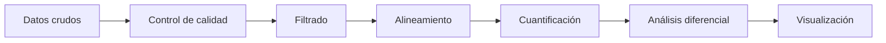
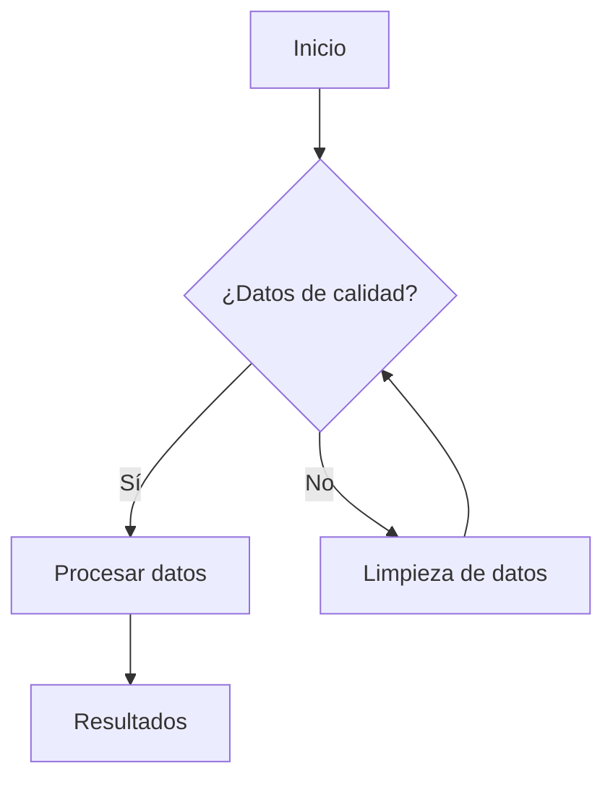

# Proyecto: Evaluación de calidad y análisis filogenético de especies del género Mycobacterium mediante herramientas bioinformáticas

## Integrantes
- Nombre 1 :smirk:
- Nombre 2 :relaxed:
- Nombre 3 :flushed:

## Objetivo
:dna: Describir el objetivo del proyecto

## Dataset
SRRXXXXXXX

## Flujo de trabajo (detallar en cada uno)
1. Descarga 
2. QC
3. Análisis

## Resultados
Resumen breve

## Cómo reproducir
### Scripts
Si es necesario genere un documento .md adicional o una carpeta para los scripts, si le hace falta (opcional)
bash scripts/pipeline.sh  

### NOTA: Hasta aquí llega el formato de README para su proyecto, en adelante le coloco información adicional


# DETALLES Y RECOMENDACIONES PARA FORMATO .md Y MÁS
El informe será un documentos en Github en formato Markdown (método de escritura, basado en un formato de texto plano).
Aquí vemos la diferencia entre un procesador de texto (tipo Word) vs Markdown, abiertos en un editor de texto plano. 


Les dejo algunos formatos para el uso :+1: :

## 1. Titulos
```
# Título primer nivel
## Título segundo nivel
###  Título tercer nivel
```
Se visualiza así:
# Título primer nivel
## Título segundo nivel
###  Título tercer nivel

## 2. Texto en negrita
```
**Hola**
```
**Hola**

## 3. Texto en cursiva

```
*Hola*
```
*Hola*

## 4. Superíndice y subíndice
```
Este es un <sub>subíndice</sub> 
Este otro es un <sup>superíndice</sup> 
```
Este es un <sub>subíndice</sub> 

Este otro es un <sup>superíndice</sup>

## 5. Adicionar línea de comando

````
```
Mira, puedes ver las comillas y formato
```
````
Se ve así:

```
Mira, puedes ver las comillas y formato
```
## 6. Links
```
Este sitio fue construido usando [GitHub](https://pages.github.com/)
```
Este sitio fue construido usando [GitHub](https://pages.github.com/)

## 7. Listas
```
Usa * - o + por ejemplo:
* Empezamos en 3
+ Empezamos en 2
- Empezamos en 1
* 0
```

Visualizamos así:
* Empezamos en 3
+ Empezamos en 2
- Empezamos en 1
* 0

## 8. Creaciones de diagramas

Creando un diagrama parcial  de pipeline:
````

````


````

````




```mermaid
flowchart LR
    A[Datos crudos] --> B[Control de calidad]
    B --> C[Filtrado]
    C --> D[Alineamiento]
    D --> E[Cuantificación]
    E --> F[Análisis diferencial]
    F --> G[Visualización]

    %% Colores de nodos con texto y borde negro
    style A fill:#f9f,stroke:#000,stroke-width:2px,color:#000
    style B fill:#bbf,stroke:#000,stroke-width:2px,color:#000
    style C fill:#bfb,stroke:#000,stroke-width:2px,color:#000
    style D fill:#ffb,stroke:#000,stroke-width:2px,color:#000
    style E fill:#fbf,stroke:#000,stroke-width:2px,color:#000
    style F fill:#fbb,stroke:#000,stroke-width:2px,color:#000
    style G fill:#bff,stroke:#000,stroke-width:2px,color:#000
```

## LINKS DE INTERES PARA SU INFORME
1. Proceso para invitar a [colaboradores](https://docs.github.com/es/repositories/managing-your-repositorys-settings-and-features/repository-access-and-collaboration/inviting-collaborators-to-a-personal-repository) a su proyecto
2. Información sobre los [repositorios](https://docs.github.com/es/repositories)
3. Aprender sobre Github en la [Guía de inicio rápido](https://docs.github.com/es/get-started/start-your-journey)
4. Síntaxis [Markdown](https://markdown.es/sintaxis-markdown/)
5. Ejercicio para iniciar con [Markdown](https://github.com/skills/communicate-using-markdown)
6. Adición de [emoticones](https://gist.github.com/rxaviers/7360908) a su página
7. Lista de [DDBB](https://github.com/BioUPS/Bioinf/blob/main/Proyecto_ejemplo/DB_list.md)
