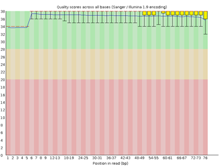
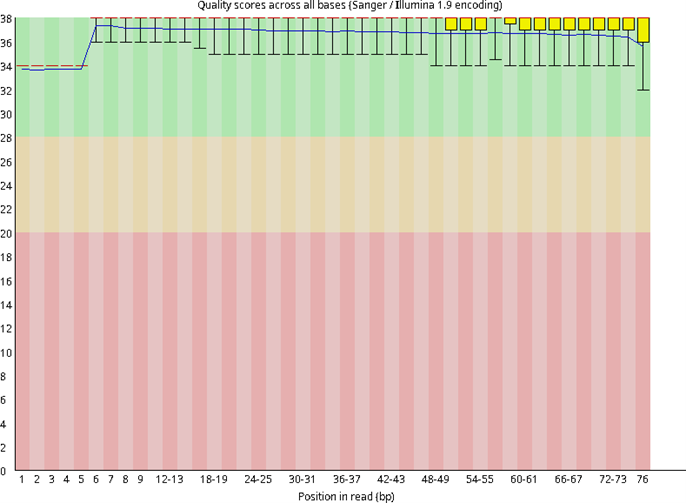
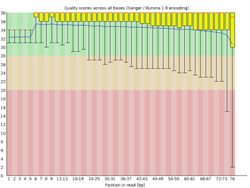
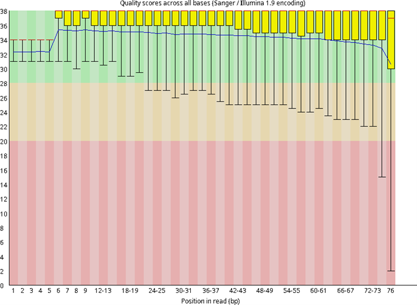
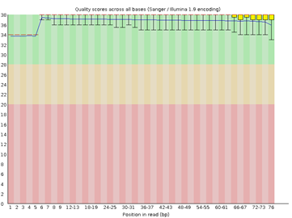
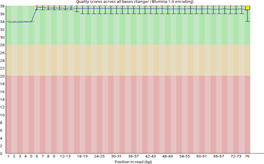
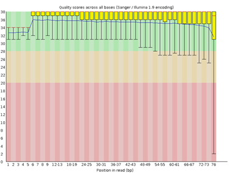
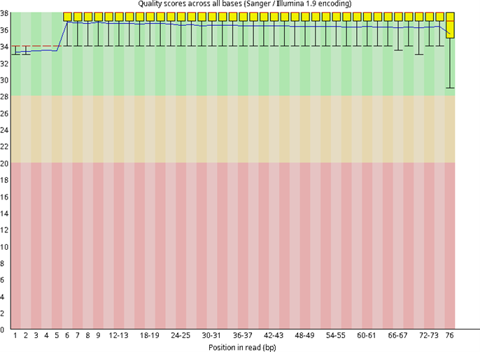
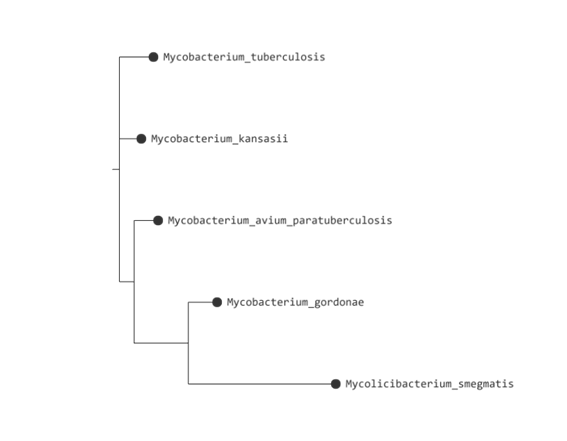

# Proyecto: Análisis de calidad y reconstrucción filogenética de secuencias de *Mycobacterium spp.* mediante herramientas bioinformáticas

## Integrantes
- Allison Baño
- Kevin Campaña
- Raúl Ramos
- Gabriela Zambrano
- Paulo Franco

## Objetivo general

Integrar herramientas bioinformáticas de control de calidad, preprocesamiento y análisis filogenético para evaluar secuencias genómicas y relaciones evolutivas entre especies del género *Mycobacterium* mediante datos de secuenciación masiva y secuencias 16S rRNA.

## Objetivos específicos

1.	Evaluar la calidad de lecturas FASTQ de *Mycobacterium tuberculosis* mediante herramientas bioinformáticas especializadas para identificar errores, adaptadores y regiones de baja calidad en los datos de secuenciación.
2.	Realizar el preprocesamiento y filtrado de secuencias utilizando herramientas de trimming y depuración bioinformática para optimizar la confiabilidad de los análisis posteriores.
3.	Construir e interpretar un árbol filogenético basado en secuencias 16S rRNA de diferentes especies del género *Mycobacterium* para analizar sus relaciones evolutivas y patrones de agrupamiento molecular.

### 1. Introducción

Las bacterias del género ´*Mycobacterium* representan uno de los grupos microbianos de mayor importancia médica y epidemiológica debido a que incluyen especies patógenas responsables de enfermedades como la tuberculosis y diversas micobacteriosis que afectan a humanos y animales a nivel mundial (Cuevas-Córdoba et al., 2021). *Mycobacterium tuberculosis* continúa siendo una de las principales causas de mortalidad por enfermedades infecciosas, especialmente en países en desarrollo, lo que ha impulsado el uso de herramientas moleculares y bioinformáticas para mejorar su identificación, vigilancia y caracterización genética (World Health Organization [WHO], 2024). Asimismo, la diversidad genética presente dentro del género *Mycobacterium* permite estudiar procesos evolutivos, relaciones filogenéticas y mecanismos asociados a patogenicidad y adaptación ambiental mediante el análisis de secuencias genómicas y genes conservados como el 16S rRNA (Pozo et al., 2022). En este contexto, el análisis bioinformático constituye una herramienta fundamental para comprender la variabilidad genética y las relaciones evolutivas entre especies bacterianas de importancia clínica y biológica (Peña et al., 2024).

El análisis de secuencias mediante tecnologías de secuenciación de nueva generación (NGS) ha revolucionado el estudio de microorganismos al permitir la obtención masiva de datos genéticos con alta precisión y velocidad (Peña et al., 2024). Sin embargo, las lecturas generadas pueden contener errores de secuenciación, regiones de baja calidad y adaptadores que afectan significativamente la confiabilidad de los análisis posteriores, incluyendo ensamblaje, alineamiento y filogenia (Chen et al., 2018). Por esta razón, el control de calidad y el preprocesamiento de lecturas representan etapas críticas dentro de cualquier flujo de trabajo bioinformático, ya que permiten reducir ruido técnico y mejorar la precisión de los resultados obtenidos (Andrews, 2020). Herramientas especializadas como FastQC y fastp facilitan la evaluación y depuración de secuencias FASTQ mediante análisis de calidad, trimming y filtrado, optimizando la confiabilidad de los estudios genómicos y evolutivos en bacterias patógenas (Chen et al., 2018).

El análisis filogenético basado en secuencias del gen *16S rRNA* constituye una metodología ampliamente utilizada para estudiar relaciones evolutivas entre bacterias debido a que este marcador molecular presenta regiones conservadas y variables que permiten diferenciar taxones bacterianos con alta eficiencia (Janda & Abbott, 2021). En especies del género *Mycobacterium*, la filogenia molecular ha permitido identificar agrupamientos evolutivos, diferenciar especies patógenas y no patógenas, así como comprender patrones de divergencia genética y adaptación biológica (Pozo et al., 2022). Herramientas bioinformáticas como ClustalW y FastTree permiten generar alineamientos múltiples y árboles filogenéticos reproducibles mediante métodos computacionales rápidos y precisos, facilitando la interpretación de relaciones evolutivas entre organismos microbianos (Price et al., 2020). Estos enfoques son actualmente indispensables en investigaciones relacionadas con microbiología, epidemiología molecular y vigilancia genómica de enfermedades infecciosas (Cuevas-Córdoba et al., 2021).

El presente proyecto tiene como finalidad integrar herramientas de control de calidad, procesamiento de secuencias y análisis filogenético para evaluar especies del género *Mycobacterium* mediante un enfoque bioinformático reproducible. Para ello, se emplearán secuencias FASTQ y secuencias 16S rRNA obtenidas desde bases de datos públicas como NCBI, utilizando plataformas y herramientas especializadas como Galaxy, FastQC, fastp, ClustalW y FastTree para desarrollar el flujo de trabajo bioinformático (Chen et al., 2018). El análisis permitirá comparar la calidad de las lecturas antes y después del preprocesamiento, además de interpretar relaciones filogenéticas entre especies del género *Mycobacterium* mediante la construcción de árboles evolutivos (Price et al., 2020). De esta manera, el estudio busca demostrar la importancia del control de calidad y de las herramientas bioinformáticas modernas para generar resultados confiables, reproducibles y biológicamente interpretables en investigaciones microbiológicas y genómicas (Peña et al., 2024).

### 2. Metodología

La investigación se desarrolló mediante un enfoque bioinformático aplicado al análisis de secuencias del género Mycobacterium, utilizando datos genómicos obtenidos desde bases de datos públicas del National Center for Biotechnology Information (NCBI). Para el análisis de control de calidad y preprocesamiento se emplearon lecturas paired-end de Mycobacterium tuberculosis descargadas desde el Sequence Read Archive (SRA), correspondiente al acceso ERR2510812  . La secuencia fue importada y procesada en la plataforma Galaxy debido a su capacidad para desarrollar flujos de trabajo reproducibles y accesibles en análisis de secuenciación masiva (Afgan et al., 2022). Inicialmente, la calidad de las lecturas FASTQ fue evaluada mediante la herramienta FastQC, la cual permitió analizar parámetros como calidad por base, contenido GC, secuencias duplicadas y presencia de adaptadores (Andrews, 2020). Posteriormente, se realizó el preprocesamiento y filtrado utilizando fastp para eliminar lecturas de baja calidad, adaptadores y ruido técnico, optimizando la confiabilidad de los análisis posteriores (Chen et al., 2018).

Para el análisis filogenético se utilizaron secuencias del gen 16S rRNA correspondientes a diferentes especies del género Mycobacterium, incluyendo Mycobacterium tuberculosis, Mycobacterium gordonae, Mycobacterium smegmatis, Mycobacterium kansasii, Mycobacterium avium y Mycobacterium bovis, obtenidas desde GenBank en formato FASTA . Previo al análisis, las secuencias fueron sometidas a un proceso de curación manual que incluyó revisión de headers, verificación de longitud y detección de caracteres ambiguos, con el propósito de garantizar la integridad y consistencia del dataset biológico (Janda & Abbott, 2021). Posteriormente, se realizó un alineamiento múltiple de secuencias mediante MAFFT, herramienta ampliamente utilizada para identificar regiones conservadas y variables entre organismos bacterianos (Larkin et al., 2007). Finalmente, los alineamientos fueron procesados mediante FastTree para generar árboles filogenéticos basados en máxima verosimilitud aproximada, permitiendo inferir relaciones evolutivas entre las especies analizadas (Price et al., 2020).

El flujo de trabajo bioinformático implementado integró herramientas de análisis de calidad, procesamiento y filogenia con el objetivo de garantizar reproducibilidad, confiabilidad e interpretación biológica de los resultados obtenidos . La comparación de métricas de calidad antes y después del preprocesamiento permitió evaluar la efectividad del filtrado y trimming sobre las lecturas de secuenciación, considerando indicadores como calidad promedio, reducción de adaptadores y distribución de bases ambiguas (Chen et al., 2018). Asimismo, la construcción del árbol filogenético permitió analizar patrones de agrupamiento molecular y cercanía evolutiva entre especies del género Mycobacterium, facilitando la interpretación de procesos de divergencia genética y conservación evolutiva (Cuevas-Córdoba et al., 2021). De esta manera, la metodología empleada permitió integrar herramientas bioinformáticas modernas para desarrollar un análisis microbiológico robusto y reproducible orientado al estudio evolutivo y genómico de bacterias de importancia médica.

### 3. Aplicaciones

El análisis bioinformático de calidad y las relaciones filogenéticas en especies del género Mycobacterium mediante secuenciación de nueva generación (NGS) y el uso del marcador 16S rRNA tienen diversas aplicaciones en contextos reales de investigación y microbiología clínica. En primer lugar, destaca su utilidad en la vigilancia epidemiológica de la tuberculosis, donde la NGS permite caracterizar la diversidad genética de Mycobacterium tuberculosis, identificar mutaciones relacionadas con resistencia a medicamentos y analizar patrones de transmisión entre pacientes, lo que contribuye a mejorar las estrategias de control y tratamiento de la enfermedad (Beviere et al., 2023). Asimismo, otra aplicación importante corresponde al diagnóstico molecular de infecciones bacterianas, ya que la secuenciación del gen 16S rRNA facilita la identificación precisa de especies de Mycobacterium, especialmente en casos donde los métodos convencionales como el cultivo presentan limitaciones en sensibilidad y tiempo de respuesta, mejorando significativamente el diagnóstico clínico (Andenmatten et al., 2019).

De igual manera, el empleo de tecnologías avanzadas como la metagenómica basada en NGS (mNGS) permite la detección directa de Mycobacterium sin necesidad de aislamiento previo, lo que resulta fundamental en infecciones complejas o con baja carga bacteriana, además de posibilitar la identificación simultánea de coinfecciones y otros microorganismos presentes en la muestra clínica (Li et al., 2022). 

Finalmente, el análisis filogenético mediante secuencias de 16S rRNA constituye una herramienta clave en la clasificación taxonómica y el estudio evolutivo de especies del género Mycobacterium, permitiendo diferenciar especies estrechamente relacionadas y comprender sus relaciones filogenéticas, lo cual es esencial tanto para la investigación microbiológica como para el desarrollo de métodos diagnósticos más específicos (Roth et al., 1998). En conjunto, estas aplicaciones evidencian que la metodología empleada tiene un impacto directo en la salud pública, el diagnóstico clínico y la investigación biológica.

### 4. Resultados

Las lecturas forward crudas tomadas del archivo ERR2510812 *Mycobacterium tuberculosis* presentan un total de 569 449 secuencias y aproximadamente 42,3 millones de bases, lo que evidencia un volumen considerable de información genómica para el análisis bioinformático. El porcentaje de contenido GC registrado fue de 64 % (Tabla 1), valor característico de especies del género Mycobacterium, conocidas por poseer genomas ricos en guanina y citosina. Este resultado sugiere consistencia biológica y concordancia con perfiles genómicos previamente reportados para estas bacterias.

Asimismo, ninguna secuencia fue marcada como de baja calidad, lo que indica que los datos presentan una calidad inicial aceptable para los análisis posteriores. Sin embargo, la longitud de secuencia variable entre 5 y 76 pares de bases evidencia la presencia de lecturas cortas o fragmentadas (Tabla 1), justificando la necesidad de aplicar procesos de trimming y filtrado para eliminar ruido técnico y optimizar la confiabilidad de los análisis de alineamiento y filogenia.

**Tabla 1. Resumen estadístico del FastQC inicial — Forward Reads**
| Measure | Value |
|---|---|
| Filename | ERR2510812_forward.gz |
| File type | Conventional base calls |
| Encoding | Sanger / Illumina 1.9 |
| Total Sequences | 569449 |
| Total Bases | 42.3 Mbp |
| Sequences flagged as poor quality | 0 |
| Sequence length | 5-76 |
| %GC | 64 |

La tabla presenta las métricas generales obtenidas mediante FastQC para las lecturas forward crudas de *Mycobacterium tuberculosis*. Se observa un total de 569,449 secuencias con un contenido GC de 64%, valor consistente con las características genómicas de la especie. La longitud de lectura varió entre 5 y 76 pb, indicando la presencia de fragmentos cortos potencialmente asociados a regiones de baja calidad. No se detectaron secuencias marcadas como completamente deficientes.

**Figura 1. Calidad por base de las lecturas forward antes del preprocesamiento (a. Calidad en Galaxy; b. Calidad en Maquina Virtual)**  

El gráfico de calidad por base correspondiente a las lecturas forward del dataset crudo de *Mycobacterium tuberculosis* muestra valores elevados de calidad al inicio de las secuencias, representados principalmente en la zona verde del gráfico. Sin embargo, hacia las posiciones finales de lectura se observa una disminución progresiva de los valores Phred, indicando pérdida de precisión en los ciclos finales de secuenciación Illumina. Este comportamiento es común en datos de secuenciación paired-end y justifica la necesidad de aplicar procedimientos de control de calidad y trimming.

**Tabla 2. Resumen estadístico del FastQC inicial — Reverse Reads** 
| Measure | Value |
|---|---|
| Filename | ERR2510812_reverse.gz |
| File type | Conventional base calls |
| Encoding | Sanger / Illumina 1.9 |
| Total Sequences | 569449 |
| Total Bases | 42.3 Mbp |
| Sequences flagged as poor quality | 0 |
| Sequence length | 6-76 |
| %GC | 64 |

La tabla resume las métricas de calidad obtenidas para las lecturas reverse del dataset crudo. Los resultados muestran un número total de secuencias y contenido GC similares a los observados en las lecturas forward, indicando consistencia entre ambos conjuntos paired-end. La presencia de lecturas cortas sugiere posibles regiones de baja calidad o artefactos derivados de la secuenciación.

**Figura 2. Calidad por base de las lecturas reverse antes del preprocesamiento (a. Calidad en Galaxy; b. Calidad en Maquina Virtual)**  

Las lecturas reverse presentan un patrón similar al observado en las lecturas forward. La calidad inicial es alta y estable, mientras que las regiones terminales muestran una disminución progresiva de los scores de calidad. Este comportamiento puede introducir errores en análisis posteriores, como alineamientos o inferencias filogenéticas, si las lecturas no son previamente procesadas.

3)	trimming con fastp
Procesamiento: trimming, filtrado, limpieza. para: limpiar reads, recortar extremos malos, mejorar calidad.

 **Tabla 3. Resumen estadístico del FastQC post-procesamiento — Forward Reads**  
| Measure | Value |
|---|---|
| Filename | fastp on dataset 5 and 6.gz |
| File type | Conventional base calls |
| Encoding | Sanger / Illumina 1.9 |
| Total Sequences | 550032 |
| Total Bases | 40.8 Mbp |
| Sequences flagged as poor quality | 0 |
| Sequence length | 15-76 |
| %GC | 64 |

La tabla muestra las métricas obtenidas después del procesamiento con *fastp* para las lecturas forward. 
Se observa una reducción en el número total de secuencias y bases totales, resultado esperado tras la eliminación de fragmentos de baja calidad. La longitud mínima aumentó de 5 a 15 pb, indicando un filtrado efectivo de lecturas extremadamente cortas.
 

**Figura 3. Calidad por base de las lecturas forward después del preprocesamiento con fastp (a. Calidad en Galaxy; b. Calidad en Maquina Virtual)**  

Tras el procesamiento con *fastp*, las lecturas forward muestran una distribución de calidad más homogénea y estable a lo largo de toda la secuencia. Las regiones de baja calidad observadas previamente fueron eliminadas o corregidas, lo que mejora significativamente la confiabilidad de los datos para análisis bioinformáticos posteriores.

**Tabla 4. Resumen estadístico del FastQC post-procesamiento — Reverse Reads**  
| Measure | Value |
|---|---|
| Filename | fastp on dataset 5 and 6.gz |
| File type | Conventional base calls |
| Encoding | Sanger / Illumina 1.9 |
| Total Sequences | 550032 |
| Total Bases | 40.8 Mbp |
| Sequences flagged as poor quality | 0 |
| Sequence length | 15-76 |
| %GC | 65 |

La tabla resume las métricas de calidad obtenidas para las lecturas reverse después del preprocesamiento. 
El contenido GC permaneció estable (64–65%), lo que indica que el procesamiento no alteró significativamente la composición biológica del dataset. La disminución en el número de secuencias refleja la eliminación de lecturas problemáticas.

**Figura 4. Calidad por base de las lecturas reverse después del preprocesamiento con fastp (a. Calidad en Galaxy; b. Calidad en Maquina Virtual)**  

Las lecturas reverse procesadas presentan una mejora general en los valores de calidad respecto al dataset inicial. Se evidencia una reducción de las regiones con scores bajos y una mayor estabilidad en los valores Phred, indicando que el preprocesamiento eliminó exitosamente secuencias problemáticas y mejoró la calidad global del dataset.

**Tabla 5. Fasta QC con Fasta statistics**
| Column 1 | Column 2 |
|---|---|
| Scaffold L50 | 3 |
| Scaffold N50 | 1487 |
| Scaffold L90 | 5 |
| Scaffold N90 | 1442 |
| Scaffold len_max | 1532 |
| Scaffold len_min | 1442 |
| Scaffold len_mean | 1492 |
| Scaffold len_median | 1487 |
| Scaffold len_std | 34 |
| Scaffold num_A | 1627 |
| Scaffold num_T | 1503 |
| Scaffold num_C | 1787 |
| Scaffold num_G | 2547 |
| Scaffold num_N | 0 |
| Scaffold num_bp | 7464 |
| Scaffold num_bp_not_N | 7464 |
| Scaffold num_seq | 5 |
| Scaffold GC content overall | 58.07 |
| Contig L50 | 3 |
| Contig N50 | 1487 |
| Contig L90 | 5 |
| Contig N90 | 1442 |
| Contig len_max | 1532 |
| Contig len_min | 1442 |
| Contig len_mean | 1492 |
| Contig len_median | 1487 |
| Contig len_std | 34 |
| Contig num_bp | 7464 |
| Contig num_seq | 5 |
| Number of gaps | 0 |

La tabla de FASTA Statistics resume las características generales del conjunto de 5 secuencias del gen 16S rRNA de *Mycobacterium* spp. Se observa que las secuencias presentan longitudes similares, entre 1442 y 1532 pares de bases, con una longitud promedio de 1492 bp. La composición nucleotídica incluye 1627 adeninas, 1503 timinas, 1787 citosinas y 2547 guaninas, sin presencia de bases ambiguas (N). El contenido GC global es de 58.07%, y el dataset contiene un total de 7464 pares de bases distribuidos en 5 secuencias.

**Figura 5. Árbol filogenético. basado en secuencias 16S rRNA de distintas especies del género Mycobacterium y Mycolic Bacterium**  

La imagen representa un árbol filogenético basado en secuencias 16S rRNA de distintas especies del género Mycobacterium y Mycolicibacterium. Cada nodo terminal (hoja) corresponde a una especie, y las ramas representan su relación evolutiva estimada a partir de la similitud genética.
El árbol evidencia que: M. tuberculosis y M. kansasii están más relacionados entre sí que con el resto de especies analizadas.Las especies ambientales (M. gordonae y M. smegmatis) forman un clado separado. M. avium paratuberculosis se posiciona como un grupo intermedio.

### 5. Discusión (citar)
 

### 6. Conclusiones  

### 7. Referencias bibliográficas  
Genere un grupo en Mendeley con sus compañeros de proyecto. Coloque todas sus fuentes y los respectivos PDFs de cada una  

## NOTA
:eyes: Deberá invitarme a su grupo en Mendeley o las plataformas usadas al correo bioupsmantigua@gmail.com
